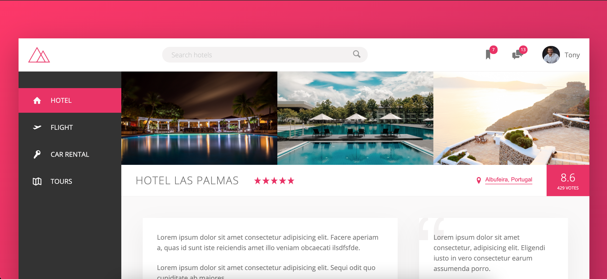

# Trillo

> This project focusses on CSS Flexbox, as well as advanced CSS concepts like pseudo-classes and pseudo-elements. 

---

### Table of Contents

- [Trillo](#trillo)
    - [Table of Contents](#table-of-contents)
  - [Description](#description)
      - [Technologies](#technologies)
  - [How To Use](#how-to-use)
  - [References](#references)
  - [Author Info](#author-info)

---

## Description

This project is the second of three built while taking Jonas Schmedtmann's course "Advanced CSS and Sass: Flexbox, Grid, Animations and More!" on Udemy. It is an excellent example of the power of CSS Flexbox. It also utilizies more advanced concepts like CSS psuedo-selectors and animations.

#### Technologies

- Sass (.scss)
- HTML5
- CSS3
- Django
- npm
- Docker

[Back To The Top](#trillo)

---

## How To Use

This project is currently deployed using Docker on a Heroku free-tier dyno.

It can be viewed live at [atummillo-trillo.herokuapp.com](https://atummillo-trillo.herokuapp.com/)
- (The site may take up to 15 seconds to load if the server has not been contacted in a while)

[Back To The Top](#trillo)

---

## References

<a href="https://www.udemy.com/course/advanced-css-and-sass/">"Advanced CSS and Sass: Flexbox, Grid, Animations and More!"</a> by Jonas Schmedtmann

[Back To The Top](#trillo)

---

## Author Info

- Personal Website - [anthonytummillo.com](https://anthonytummillo.com)
- Codepen - [codepen.io/ATummillo](https://codepen.io/ATummillo/)
- LinkedIn - [linkedin.com/in/anthonytummillo](https://www.linkedin.com/in/anthonytummillo/)
- Email - atummillo.dev@gmail.com

[Back To The Top](#trillo)